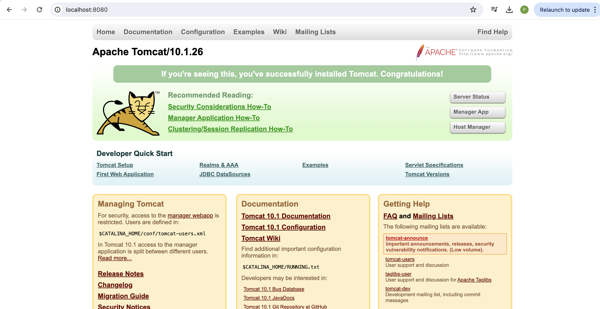
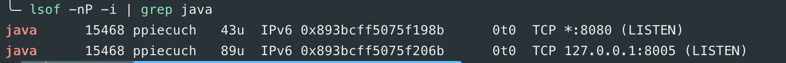
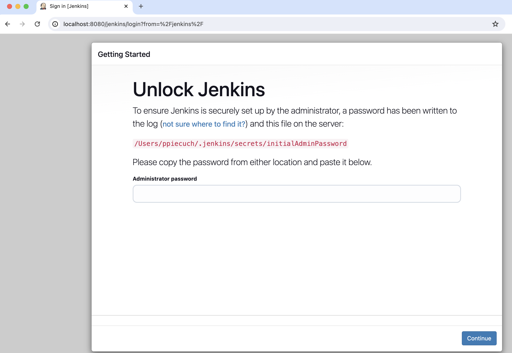
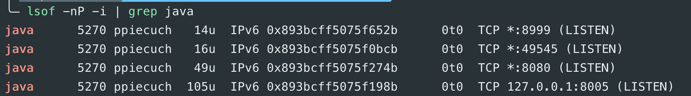
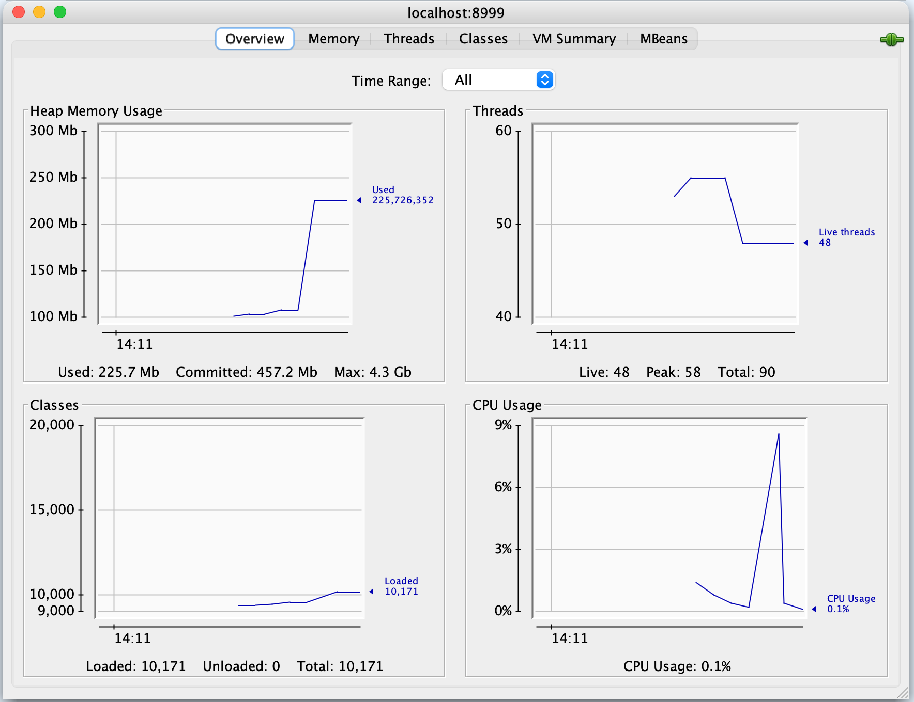
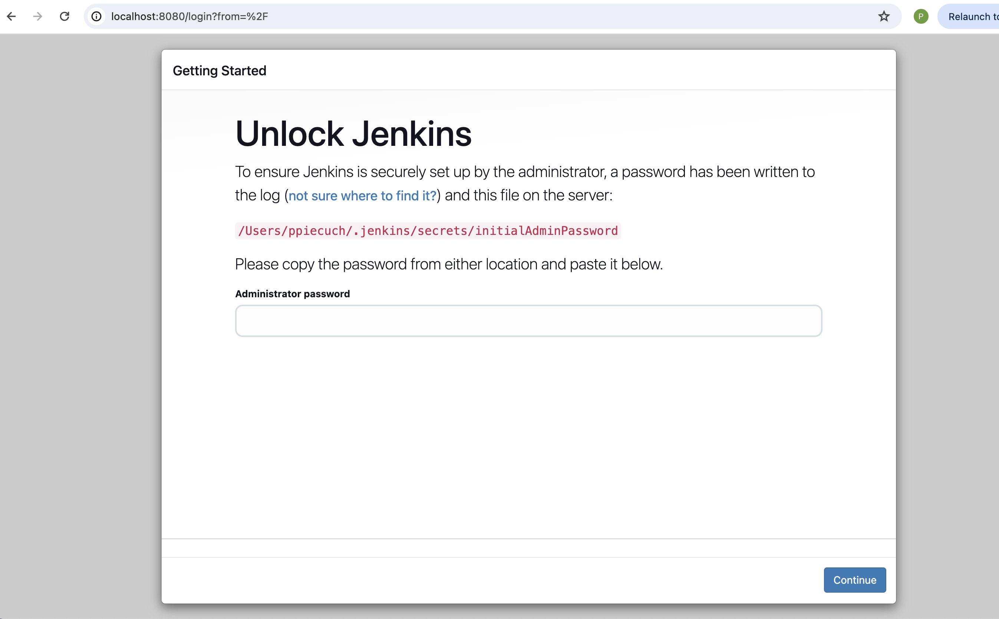

### Launch the server

```bash
./startup.sh
```

### Check if server is running

http://localhost:8080/



### Identifying ports

Two ports: 8080 and 8005



### Starting jenkins server

http://localhost:8080/jenkins



### Enable JMX monitoring

bin/catalina.sh

```bash
CATALINA_OPTS="$CATALINA_OPTS -Dcom.sun.management.jmxremote \
-Dcom.sun.management.jmxremote.port=8999 \
-Dcom.sun.management.jmxremote.rmi.port=8999 \
-Dcom.sun.management.jmxremote.authenticate=false \
-Dcom.sun.management.jmxremote.ssl=false \
-Djava.rmi.server.hostname=localhost"
```

### Start java process and check ports used by it

lsof -nP -i | grep java




### Start tomcat server with 10M min and 20M max heap size

bin/catalina.sh

```bash
export CATALINA_OPTS="-Xms10m -Xmx20m"
```

[Error](images/error.png)

### Connect to the server using JConsole

jconsole localhost:8999



### Start jenkins.war standalone

java -jar jenkins.war



